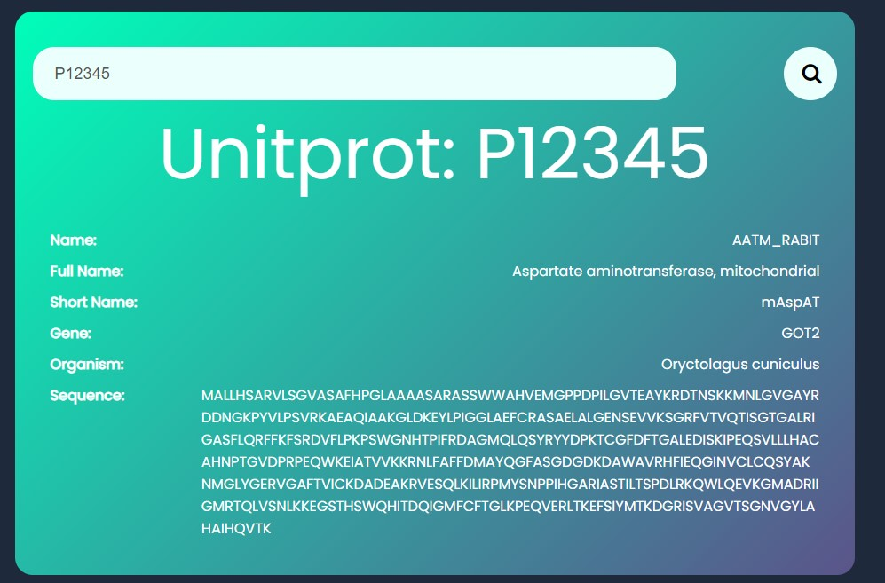

# Uniprot App Readme

## Overview

The Uniprot App is a simple web application that allows users to retrieve information about proteins using their Uniprot Accession Number. It uses the Uniprot API to fetch data and display it in a user-friendly format on the web page. This README file provides an overview of the app's structure, functionality, and how to set it up and use it.

## App Structure

The Uniprot App consists of the following components:

1. **HTML file (index.html):** This file defines the structure and layout of the web page. It includes input fields for entering Uniprot Accession Numbers and a container for displaying protein information.

2. **CSS file (style.css):** The CSS file contains styles for formatting and styling the web page's elements, making it visually appealing and user-friendly.

3. **JavaScript file (script.js):** The JavaScript file contains the logic for fetching data from the Uniprot API, parsing the XML response, and displaying protein information on the web page.

## Dependencies

The Uniprot App uses the following external dependencies:

- **Font Awesome:** The app uses Font Awesome icons for the search button. You can find the Font Awesome library included via a CDN in the HTML file.

- **Google Fonts (Poppins):** The app utilizes the Google Fonts library to style the text. It includes the Poppins font via a CDN in the HTML file.

## Getting Started

To set up and use the Uniprot App, follow these steps:

1. **Clone the Repository:** Clone the repository containing the app files to your local machine.

2. **Open the HTML File:** Open the `index.html` file in a web browser. You can do this by simply double-clicking the file or using a code editor's built-in preview feature.

## Using the App

Once you've opened the app in your web browser, you can use it as follows:

1. **Enter Uniprot Accession Number:** In the input field provided, enter the Uniprot Accession Number for the protein you want to retrieve information about.

2. **Click the Search Button:** After entering the Accession Number, click the search button (the magnifying glass icon). This will trigger the app to fetch and display the protein information.

3. **View Protein Information:** Once the information is retrieved, the app will display various details about the protein, such as its name, full name, gene, organism, and sequence, in a user-friendly format.

## Contributing

If you want to contribute to the Uniprot App or make improvements, please follow these guidelines:

1. Fork the repository to your GitHub account.

2. Create a new branch for your changes.

3. Make your changes or improvements in the branch.

4. Commit your changes with clear and concise commit messages.

5. Create a pull request to merge your branch into the main repository.

## Issues and Support

If you encounter any issues with the Uniprot App or need assistance, please create an issue in the GitHub repository. I will do our best to address and resolve any problems or questions you may have.

